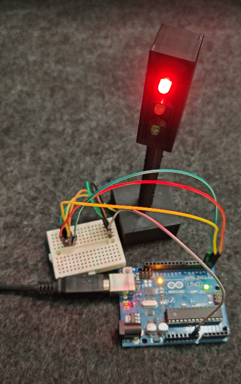

# 3D-Printed Arduino Traffic Light

> Red → Yellow → Green → **Yellow** → back to Red  
> Press-fit only — no screws or glue.



---

## Features
- **Modular design** — every part supplied as both  
  *a single “plate” STL* **and** *separate STLs* (`/hardware/stl/`)
- **Non-blocking firmware** (pure `millis()` timing) — easy to extend
- **Safe LED drive** — 220 Ω series resistors prevent over-current
- Fits an Arduino Uno or Nano inside the pole

---

## Bill of Materials

| Qty | Item                               | Notes                |
|----:|------------------------------------|----------------------|
| 1   | Arduino Uno *(or Nano)*            | 5 V board            |
| 3   | LED 5 mm (red / yellow / green)    | Diffused or clear    |
| 3   | 220 Ω resistor, ¼ W                | One per LED          |
| —   | Jumper wires                       | Male–male            |
| 1 set | 3D-printed parts                 | **Choose one:**<br>• `all-in-one_plate.stl`<br>• individual STLs |

---

## Printing

- **Fast route:**  
  Drag `all-in-one_plate.stl` into your slicer, slice with your normal PLA profile and print — no further tweaks required.  
- **Custom route:**  
  Use the individual STLs if you want multi-colour prints, different layer heights, or to re-orient parts independently.

The model is support-friendly and tolerant of various machines & layer heights.

---

## Wiring & Pinout

LED Red → D0 ─┐
LED Yellow → D1 ┼─ 220 Ω → GND
LED Green → D2 ┘


> **Using Serial?**  
> Pins 0-1 share the USB RX/TX lines. If you need `Serial.print()`, move LEDs to Pins 8-9-10 and update `LED_PINS[]` in `firmware/traffic_light.ino`.

---

## Uploading the Firmware

```bash
# Arduino IDE
Tools ▸ Board  : “Arduino Uno”
Tools ▸ Port   : COMx / /dev/ttyUSBx
Upload (Ctrl+U)
